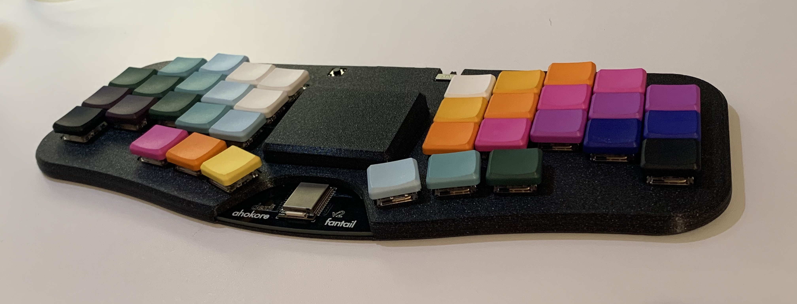
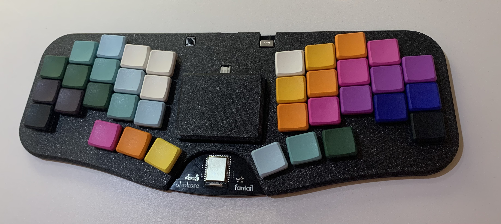
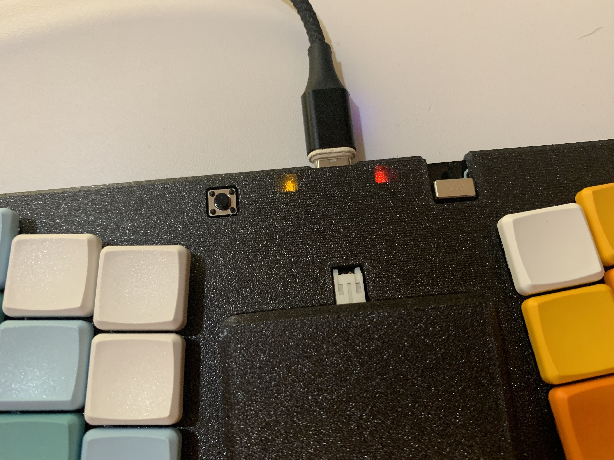
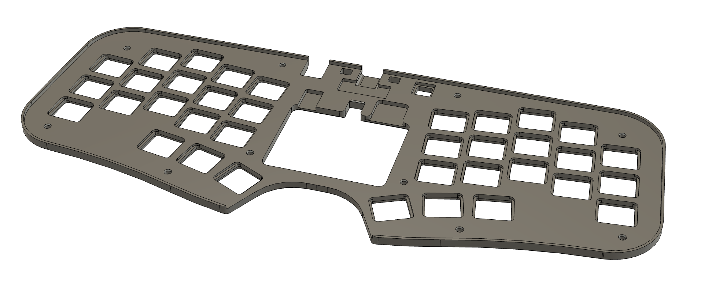
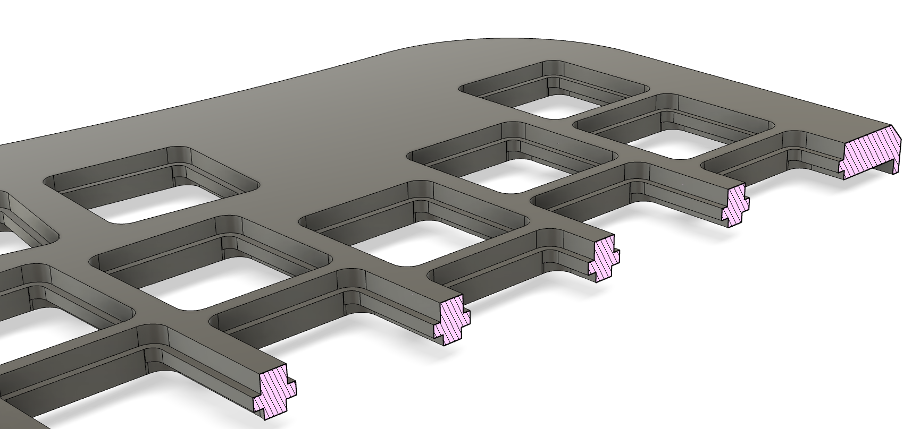
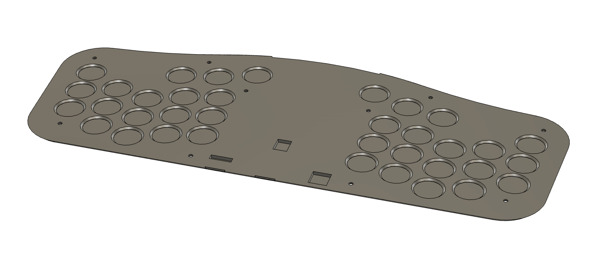
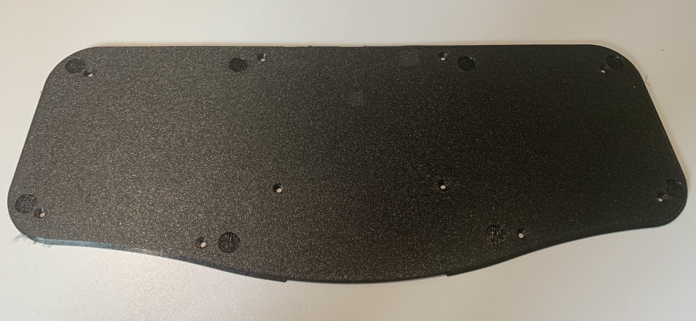
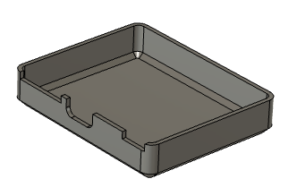
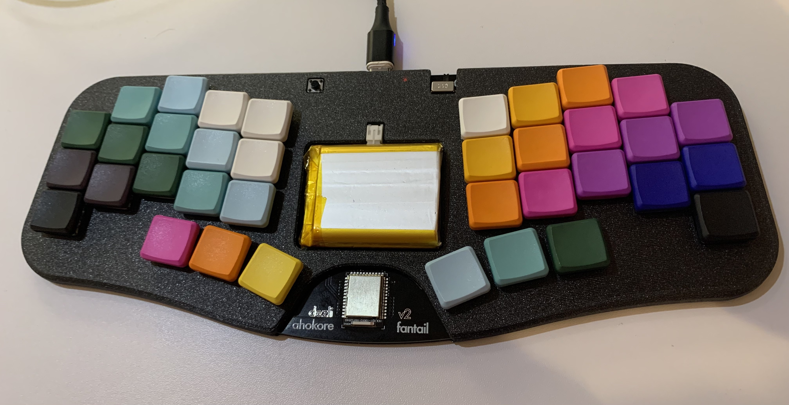
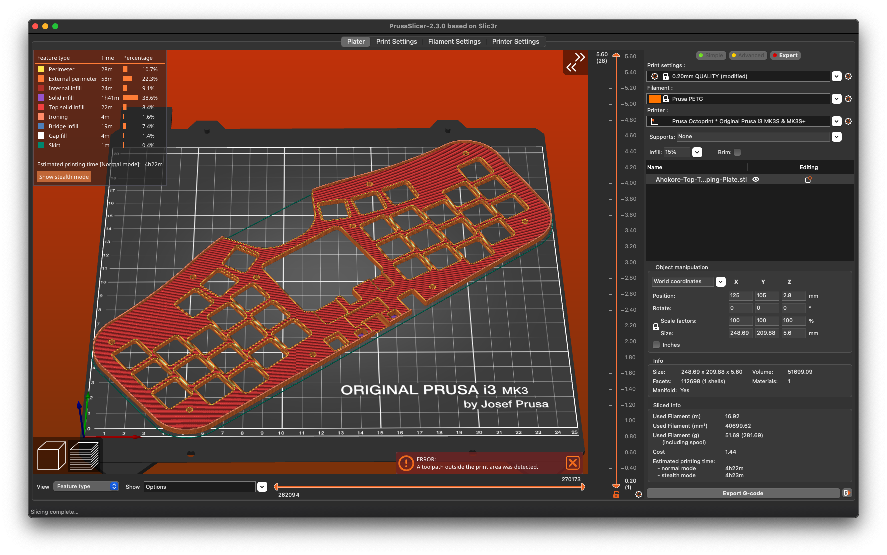

# Ahokore Case

A 3D printable case for [Dezli's Ahokore keyboard](https://github.com/dezlidezlidezli/ahokore).

## TL;DR

 * Pick one of the 4 Top case variants - use Ahokore-Top-Tapping-Slipover.stl
   if unsure.
 * Base and battery cover are optional.
 * If using the base you need 10x M2 4-5mm screws, ideally countersunk.
 * If not using the base you need 10x 4mm screws. 5mm may be too long.
 * This is a *tight* fit on most printers. You can probably ignore warnings
   about out-of-bounds toolpaths (at least on a non-mini Prusa printer). Disable
   "loops" if you're worried.
 * Print at 0.3mm layer height. Enable "ironing" for the base.

## Case Top

The case top has a couple of different options:

 * Ahokore-Top-Heatset-Plate.stl
 * Ahokore-Top-Heatset-Slipover.stl
 * Ahokore-Top-Tapping-Plate.stl
 * Ahokore-Top-Tapping-Slipover.stl

You only need one of these, here's how to decide which one:

### Heatset or Tapping

The heatset variant has big holes for inserting heatset inserts (which can be
pressed in with a soldering iron).

Supported heatset inserts are M2 3mm wide, up to 3mm long.

These make a much more resilient screw hole but obviously requires you to have
heatset inserts on hand, so there's an alternative variant with smaller holes
that you can screw an M2 screw into directly.

 * Choose "Heatset" if you have heatset inserts
 * Choose "Tapping" if you do not have heatset inserts and want to screw directly into plastic

### Plate or Slipover

The case was originally designed with an integrated plate which makes things a
bit more solid and stable, but obviously means desoldering your switches to
install it. So there's an alternative "slipover" version that will slide over
your switches so you don't need to desolder.

 * Choose "Plate" if you haven't installed your switches yet
 * Choose "Slipover" if you have installed switches and don't want to desolder them

Plate:

Slipover:

## Base

The base is optional, and can be omitted if you don't want to cover up the
fantastic PCB artwork, or you want to make it as low profile as possible
(omitting the base saves you about 1.5mm of height).

(yeah I haven't soldered the switches in that pic!)

Recommended screws are M2 5mm Countersunk (although non-countersunk screws also
work).

If you want to go without the base, then you'll need M2 4mm button head screws
(don't use countersunk screws for this configuration!)

## Battery Cover

The battery cover is also optional, it's big enough to (just) fit a massive
2400MAh battery, so pretty much anything should fit under there.

Currently it's just push fit into the battery cutout (this probably needs
improvement!)

## Printing

So, this thing *only just* fits on my Prusa i3 MK3S bed, and then only at a
very specific angle (of 36°). I've set up the STLs so they have this angle
hard-coded, so you should just be able to print directly.

Even then, if you have "loops" enabled you'll get an error about toolpaths
being out of bounds after slicing.

You can either disable loops to fix this, or just ignore it. At least on my
setup it prints fine even with loops enabled.

### Top

Aside from the warnings above about toolpaths, there's not much to think about,
I'd recommend printing the top upside-down (that orientation is already set in
the STLs), and at 0.3mm layer height. There doesn't seem to be much reason to go
smaller than that.

### Base

Like the top, the base barely fits on a Prusa's bed, and will generate warnings
if loops are enabled which can usually be ignored.

I'd recommend printing the base with ironing enables as this will greatly
improve the accuracy of the top surface, which will allow it to sit flush with
the top without gaps. Again there's not much reason to go smaller then 0.3mm
layer height.

### Battery Cover

Nothing interesting here, just print it.

## License

This work is licensed under [CC BY-NC-SA 4.0](https://creativecommons.org/licenses/by-nc-sa/4.0/).
Although please contact me if there's something you want to do that this
license doesn't allow.

For clarity, I do not consider charging materials and postage to print this for
someone within the community to be commercial use and thus perfectly acceptable.

